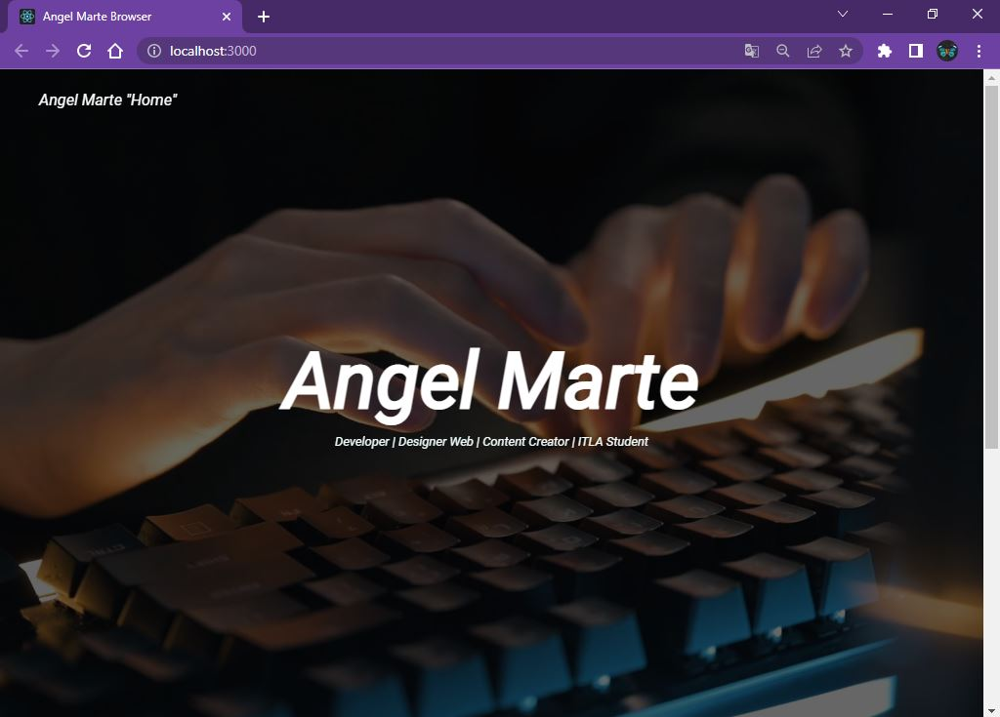

# Portafolio React (2022 Agosto)

Hola soy Angel Marte(2020-10085) estudiante del itla y esta es un projecto final de la materia de Programacion Web del docente Raydelto Hernandez

Imagenes del Portafolio

<https://github.com/AngelRafael420/NewPortafolio>

Proyecto Aprobado por el Ing. Raydelto Hernadez

Descripsion:

Hola soy Angel Marte estudiante de la carrera Tecnólogo en
software en el ITLA, es mi primera vez hacer algo como esto así que
le explicare la idea que tengo y el mandato de mi proyecto final.

Es más un Landing page es será como mi futuro portafolio también con el pasar del tiempo esta tendrá algunas API y link con redirecciones a otras páginas esta yo tengo el plan de hacerlo en editor de codigo Visual Studio Code con ReactJs y con ayuda de la extensión:

ES7+ React/Redux/React-Native snippet.

Esta me ayudara a crear interfaces de usuario interactivas de una forma más sencilla. Diseña vistas simples para cada estado en tu aplicación, y React se encargará de actualizar y renderizar de manera eficiente los componentes correctos cuando los datos cambien.

Introduciré una breve definición de quien soy y que hago y también mis redes sociales para mejor interfaz y conocimiento de quien realizo este proyecto.

Investigue por mi parte los recursos que puedo utilizar estos son:
RECURSOS:

1) Cover video
2) Imagen About
3) Roboto Tag
4) React-Carousel Documentacion
5) Imágenes portfolio
6) Font-Awesome CDN

Herramientas y Recursos:

Cover video / imagen About link

<https://www.pexels.com/es-es/>

Roboto Tag

<https://fonts.google.com/share?selection.family=Roboto:ital@1>

React-Carousel Documentacion

<https://www.npmjs.com/package/@brainhubeu/react-carousel>
<https://brainhubeu.github.io/react-carousel/docs/examples/multipleSlides>

Font-Awesome CDN

<https://cdnjs.com/libraries/font-awesome>

By: Angel Marte

Para más información:

Gmail: asarmientomarte@gmail.com
Outlook: 202010085@itla.edu.do
<https://t.me/angelrafael420_2>
